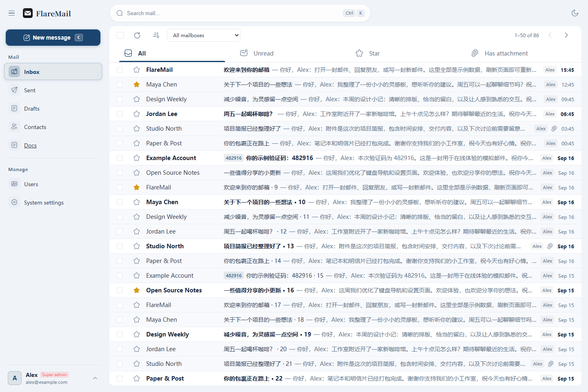

<h1 align="center">
  
</h1>

<p align="center">
  <strong>A private mailbox on your own domain, shared by invitation.</strong><br />
  使用自己的域名，拥有邀请制的私有邮箱
</p>

<p align="center">
  <a href="README.md">简体中文</a> ·
  <a href="README-en.md">English</a>
</p>

<p align="center">
  <a href="THIRD-PARTY-NOTICES.md"></a>
  
  
</p>

FlareMail is a **private domain mailbox** deployed in your own Cloudflare account. Send and receive mail with your own domain, and share the instance with family or a small team by invitation. Administrators add invited members; each member accesses their own mail.

The first formal release is **[v1.0.0](https://github.com/arctan303/FlareMail/releases/tag/v1.0.0)**. Try the online experience, then deploy for yourself or a few invited members.

<p align="center">
  <a href="https://flaremail-demo.pages.dev/inbox">Try it online</a> ·
  <a href="https://flaremail-demo.pages.dev/docs/en/introduction">Documentation</a> ·
  <a href="https://flaremail-demo.pages.dev/docs/en/deployment">Deploy your mailbox</a>
</p>



## Features

- **Mail on your own domain**: multiple domains and addresses, incoming/outgoing mail, replies, forwarding, attachments, stars and contacts.
- **Mail conversations**: one list entry per reply chain, conversation unread state, received and sent history, and collapsible quotes with original content preserved.
- **Use by invitation**: administrators manage invited members, each with their own mailbox.
- **A complete web interface**: Chinese/English, light/dark appearance, responsive layouts, keyboard shortcuts and PWA.
- **Configure as needed**: Web setup and administration, custom branding, Google login and password confirmation for sensitive changes.
- **Scripts and Agents**: personal tokens for reading, sending and replying to mail, plus separate first-party website OAuth authorization.

## Try it, then deploy

The [online experience](https://flaremail-demo.pages.dev/inbox) opens a mailbox with sample data and requires no sign-in. Read and organize messages, compose mail and explore settings. Refreshing restores the initial data; simulated sends never deliver real mail. Settings are for viewing, with language switching available.

Your real mailbox requires your own Cloudflare account and email domain. A **single Worker** serves the frontend, APIs and email handler, backed by D1 and KV with optional R2 object storage. Registering a domain in the application also requires configuring inbound routing and an outbound sending service.

[](https://deploy.workers.cloudflare.com/?url=https://github.com/arctan303/FlareMail)

Deploy through the Cloudflare web page without a local terminal. Create your administrator in the Web wizard, then connect mail routing and sending. Existing instances should follow the update guide and preserve their resources.

Start with the [deployment guide](https://flaremail-demo.pages.dev/docs/en/deployment). See the [user guide](https://flaremail-demo.pages.dev/docs/en/usage), [configuration](https://flaremail-demo.pages.dev/docs/en/configuration), [CLI / Agent](https://flaremail-demo.pages.dev/docs/en/cli) and [updates](https://flaremail-demo.pages.dev/docs/en/updates). Documentation source is in [apps/web/docs/en](apps/web/docs/en).

## Local development

`main` contains the latest stable version; `dev` is for ongoing development. Start contribution branches from `dev`; see the [release process](RELEASING.md) for the branch gate, bilingual notes, tags, and GitHub Releases.

Use Node.js ≥ 22.12 and the pinned pnpm 10.34.5. Install dependencies from the repository root:

```sh
npx --yes pnpm@10.34.5 install --frozen-lockfile
```

Prepare instance configuration using the [local development guide](apps/web/docs/en/getting-started.md), then start the real mailbox:

```sh
npx --yes pnpm@10.34.5 dev
```

To develop only the static experience and Docs, run `dev:pages`. Build with `build:pages` to `apps/web/dist-pages`; see [experience deployment](apps/web/docs/en/pages.md).

The Vue frontend is in `apps/web`, and the backend is in `apps/worker`. The real frontend builds to `apps/worker/dist`. Keep private configuration, credentials and runtime data outside source control.

See the [release notes](CHANGELOG.md) for the initial scope and deployment notes.

## Feedback & discussion

Report problems through [Issues](https://github.com/arctan303/FlareMail/issues) and discuss usage in [Discussions](https://github.com/arctan303/FlareMail/discussions). Report security vulnerabilities privately following [SECURITY.md](SECURITY.md). Future plans will be shared as development progresses.

## Contribute & license

```sh
npx --yes pnpm@10.34.5 test:web
npx --yes pnpm@10.34.5 test:worker
npx --yes pnpm@10.34.5 build
npx --yes pnpm@10.34.5 build:pages
```

FlareMail's own source uses [MIT](LICENSE). The combined distribution is provided under **AGPL-3.0-or-later**; see [Third-party notices](THIRD-PARTY-NOTICES.md).

FlareMail is one of the products in the 一方 family, developed over three months. The maintainer uses it as a primary mailbox and will continue maintaining it.
