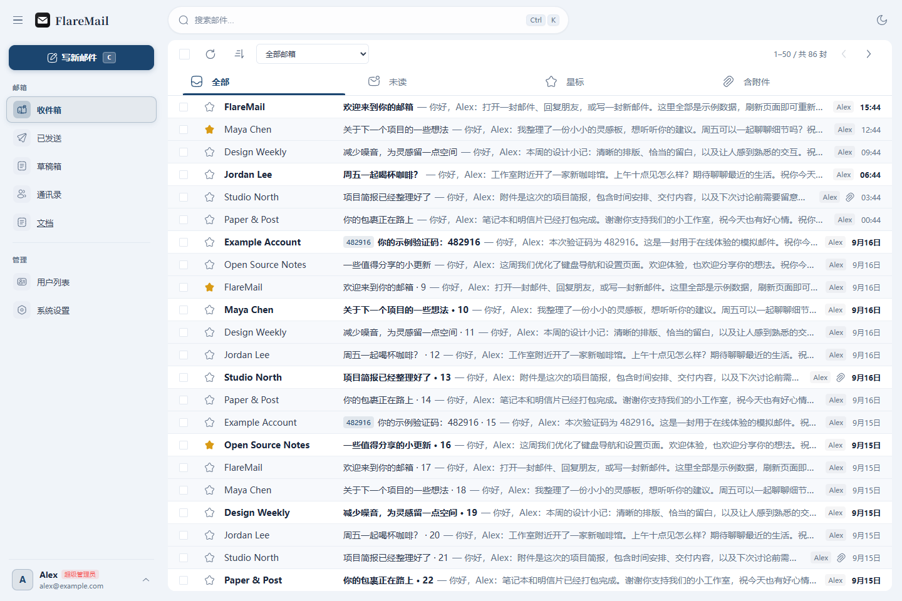

<h1 align="center">
  
</h1>

<p align="center">
  <strong>使用自己的域名，拥有邀请制的私有邮箱</strong><br />
  A private mailbox on your own domain, shared by invitation.
</p>

<p align="center">
  <a href="README.md">简体中文</a> ·
  <a href="README-en.md">English</a>
</p>

<p align="center">
  <a href="THIRD-PARTY-NOTICES.md"></a>
  
  
</p>

FlareMail 是部署在自己 Cloudflare 账号上的**私有域名邮箱**。使用自己的域名收发邮件，以邀请制与家人或小团队共享；管理员添加受邀成员，每个人独立访问自己的邮件。

正式首版 **[v1.0.0](https://github.com/arctan303/FlareMail/releases/tag/v1.0.0)**。建议先在线体验，再部署给自己或少量受邀成员使用。

<p align="center">
  <a href="https://flaremail-demo.pages.dev/inbox">在线体验</a> ·
  <a href="https://flaremail-demo.pages.dev/docs/zh/introduction">阅读文档</a> ·
  <a href="https://flaremail-demo.pages.dev/docs/zh/deployment">部署自己的邮箱</a>
</p>



## 主要能力

- **自己的域名邮箱**：多域名、多邮箱地址，收发、回复、转发、附件、星标和联系人。
- **来往邮件会话**：同一回复链一个列表入口，新来信整段显示未读；打开即可查看收发往来，历史引用可折叠，原文完整保留。
- **邀请制使用**：管理员管理受邀成员，成员各自使用自己的邮箱。
- **完整 Web 界面**：中英双语、深浅色主题、响应式布局、键盘快捷键及 PWA。
- **按需配置**：Web 安装与管理、自定义品牌、Google 登录和敏感操作二次确认。
- **脚本与 Agent 接入**：个人令牌用于邮件查询、发送与回复；另支持第一方网站 OAuth 授权。

## 先体验，再部署

[在线体验](https://flaremail-demo.pages.dev/inbox)直接进入使用示例数据的邮箱，无需登录。可以阅读和整理邮件、写信、查看设置；刷新恢复初始数据，模拟发送不会投递真实邮件。设置以展示为主，语言可以切换。

部署正式邮箱需要自己的 Cloudflare 账号与邮箱域名。前端、API 和邮件处理统一由**单个 Worker** 提供服务，使用 D1 和 KV，R2 为可选对象存储。应用内登记域名后，还需配置收信路由和发信服务。

[](https://deploy.workers.cloudflare.com/?url=https://github.com/arctan303/FlareMail)

推荐使用 Cloudflare 网页一键部署，无需本机命令行。部署后在 Web 向导创建管理员，再接通收发信；已有实例按更新指南保留原资源。

从[部署指南](https://flaremail-demo.pages.dev/docs/zh/deployment)开始。更多说明见[使用指南](https://flaremail-demo.pages.dev/docs/zh/usage)、[配置说明](https://flaremail-demo.pages.dev/docs/zh/configuration)、[CLI / Agent](https://flaremail-demo.pages.dev/docs/zh/cli)和[更新维护](https://flaremail-demo.pages.dev/docs/zh/updates)。文档源码位于 [apps/web/docs/zh](apps/web/docs/zh)。

## 本地开发

`main` 保持最新稳定版本，`dev` 用于日常开发。参与开发请从 `dev` 创建工作分支；分支门禁、双语日志、标签与 Release 规则见[发布流程](RELEASING.md)。

需要 Node.js ≥ 22.12，使用锁定的 pnpm 10.34.5。在仓库根目录安装依赖：

```sh
npx --yes pnpm@10.34.5 install --frozen-lockfile
```

先按[本地运行与开发](apps/web/docs/zh/getting-started.md)准备实例配置，再启动正式邮箱：

```sh
npx --yes pnpm@10.34.5 dev
```

仅开发静态体验站与 Docs，运行 `dev:pages`；使用 `build:pages` 构建至 `apps/web/dist-pages`。详见[部署体验站](apps/web/docs/zh/pages.md)。

Vue 前端位于 `apps/web`，后端位于 `apps/worker`；正式前端构建输出至 `apps/worker/dist`。私有配置、凭据和运行数据不进入源码仓库。

首版范围与部署注意事项见[发布说明](CHANGELOG.md)。

## 反馈与交流

通过 [Issues](https://github.com/arctan303/FlareMail/issues) 反馈问题，通过 [Discussions](https://github.com/arctan303/FlareMail/discussions) 交流使用。安全漏洞请按 [SECURITY.md](SECURITY.md) 私密报告。后续计划随实际进展公布。

## 贡献与许可

```sh
npx --yes pnpm@10.34.5 test:web
npx --yes pnpm@10.34.5 test:worker
npx --yes pnpm@10.34.5 build
npx --yes pnpm@10.34.5 build:pages
```

FlareMail 自身源码采用 [MIT](LICENSE)，完整分发物整体按 **AGPL-3.0-or-later** 提供，见[第三方通知](THIRD-PARTY-NOTICES.md)。

FlareMail 是一方产品之一，历时三个月开发。维护者已将它作为日常主力邮箱使用，并将持续维护。
